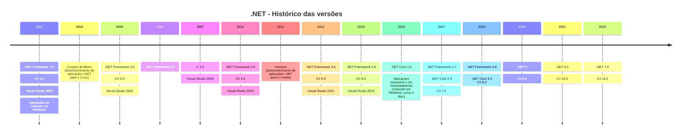
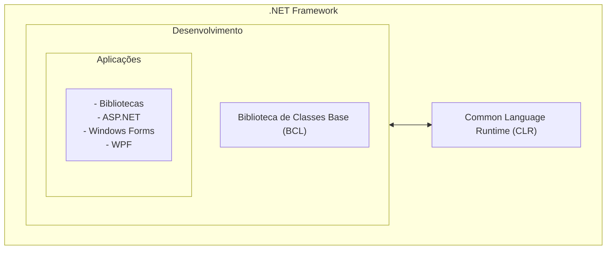
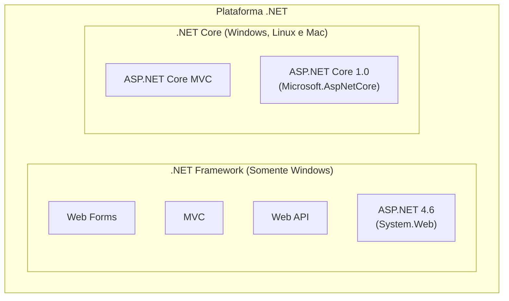
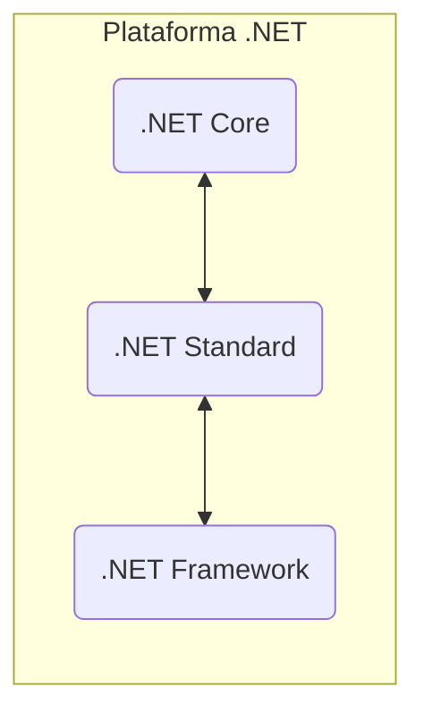

# Curso C# Essencial 2023 (.NET 7)

Este curso aborda a linguagem C#.

## Introdução

### A plataforma .NET

o .NET é uma plataforma de código aberto, multiplataforma e gratuita para construir diferentes tipos de aplicativos usando várias linguages, editores e bibliotecas.
Podemos criar aplicações .NET usando o C#, o F# e o Visual Basic que poderão ser executadas em qualquer sistema operacional compatível. Algumas poderão ser multiplataforma e outras serão específicas para um sistema operacional e dispositivos.
A plataforma .NET atual fornece um conjunto padrão de bibliotecas de classes básicas e APIs comuns a todos os aplicativos .NET.

#### Versões da plataforma .NET



##### .NET Framework - 2002

O .NET Frameworks é um ambiente de execução da Microsoft e gerenciado para Windows que oferece uma série de serviços voltados ao desenvolvimento web e desktop reutilizando e reaproveitando códigos e possuindo componentes para criar código usando as linguagens C#, VB.NET e F#.

- CLR (Common Language Runtime): Um mecanismo de execução que manipula aplicativos em execução (máquina virtual);
- BCL (Base Class Library): o .NET Framework oferece uma biblioteca de códigos testados e reutilizáveis que os desenvolvedores podem chamar de seus próprios aplicativos;



##### .NET Core - 2016

A .NET Core é uma plataforma para desenvolvimento de aplicações lançadas em 2016 como um projeto de código aberto, sendo uma solução mais leve e modular que o .NET Framework e pode ser usada em diferentes sistemas operacionais como Windows, Mac e Linux.
Antes da unificação podíamos desenvolver aplicações usando a .NET Core ou o .NET Framework que é suportado apenas no Windows e cuja última versão é a versão 4.8.
Ambos os frameworks compartilham muitos dos mesmos componentes e você podia compartilhar código entre os dois, no entando, existiam diferenças fundamentais entre os dois e sua escolha ia depender do que você desejava realizar.
Ou seja, depois do lançamento do .NET Core, a plataforma .NET passou a abrigar dois grandes frameworks: o .NET Framework, voltado para o desenvolvimento para o Windows, e o .NET Core, um ambiente multiplataforma.



Vale lembrar que certos tipos de aplicações como Windows Forms, WPF e demais só eram suportadas no .NET Framework, logo, não era possível executá-las no .NET Core, o mesmo acontecia com aplicações ASP.NET Core MVC, que não podiam ser executadas no .NET Framework

##### .NET Standard - O início da unificação

O .NET Standard surgiu para ser um meio termo entre o .NET Framework e o .NET Core, ele é uma interface que define a lista de APIs que uma determinada função do .NET deve suportar.
Uma biblioteca escrita utilizando o .NET Standar pode ser suportada tanto por aplicações .NET Core quanto aplicações .NET Framework.



<!-- ```mermaid
graph TB
subgraph "Plataforma .NET"
  subgraph ".NET Framework"
    A["WPF"];
    B["Windows Forms"];
    C["ASP.NET"];
  end
  subgraph ".NET Core"
    D["UWP"];
    E["ASP.NET Core"];
  end
  subgraph "Xamarin"
    F["iOS"];
    G["OS X"];
    H["Android"];
  end
  I[".NET Standard"];
  subgraph "Infraestrutura comum"
    J["Compiladores"];
    K["Linguagens"];
    L["Componentes de runtime"];
  end
  ".NET Framework" <--> I;
  ".NET Core" <--> I;
  "Xamarin" <--> I;
  "Infraestrutura comum" <--> I;
end
``` -->
